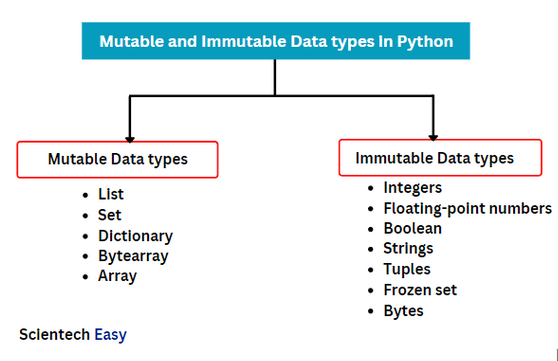

# 1 — Core definitions (one-line)

* **Module**: the unit Python imports (not relevant here).
* **Object**: any value in Python is an object (has identity, type, value).
* **Immutable object**: you cannot change its value after it’s created (e.g. `int`, `float`, `str`, `tuple`, `frozenset`, `bytes`).
* **Mutable object**: its contents/state *can* be changed in place (e.g. `list`, `dict`, `set`, `bytearray`, most user-defined objects).



# 2 — Assignment semantics (what `x = ...` actually does)

In Python `x = 10` does **not** reserve a 4-byte slot and put `10` there like C. Instead:

* Python creates (or reuses) an **int object** representing `10` and **binds the name** `x` to that object.
* Rebinding (`x = 88`) binds `x` to a different int object (`88`). The original `10` object may be kept alive if other names reference it.

Illustration (REPL):

```py
>>> x = 10
>>> y = x
>>> id(x), id(y)
(140027..., 140027...)   # same object id
>>> x = 15
>>> id(x), id(y)
(140028..., 140027...)   # x now points to a different object; y still to old one
```

# 3 — Mutability in action (in-place vs rebind)

Mutable object example (list):

```py
>>> a = [1,2,3]
>>> b = a
>>> b.append(4)
>>> a
[1, 2, 3, 4]   # changed via b because a and b reference the same list object
```

Immutable example (int/str):

```py
>>> s = "hello"
>>> t = s
>>> s = s.upper()
>>> t
'hello'        # t unchanged; s now references a new str object
```

# 4 — Why this matters: aliasing and side-effects

Because names are references to objects, sharing a mutable object between variables/functions leads to observable side-effects. This is the root of a lot of bugs (and also useful when you want in-place efficiency).

# 5 — Function parameters and mutability

Parameters are passed as references to objects (call by object-reference). Mutating a mutable argument changes caller-visible state:

```py
def f(lst):
    lst.append(99)

L = [1]
f(L)
L  # -> [1, 99]
```

If you reassign the parameter name inside the function, the caller is unaffected:

```py
def g(lst):
    lst = []   # rebinds local name only

L = [1]
g(L)
L  # still [1]
```

# 6 — Copying: shallow vs deep

* **Shallow copy** copies container structure but not nested objects.

  ```py
  a = [[1],[2]]
  b = a.copy()    # shallow
  b[0].append(9)
  a  # nested changed -> [[1,9],[2]]
  ```
* **Deep copy** duplicates nested objects (`copy.deepcopy()`).

# 7 — Immutability and hashability

* Immutable objects are typically hashable → usable as dict keys / set members (e.g. `int`, `str`, `tuple` of hashables).
* Mutable objects are not hashable (e.g. `list`, `dict`, `set`) because their value can change which would break hash invariants.

Edge case: `tuple` is immutable but `tuple` containing a `list` is not hashable because `list` is unhashable.

# 8 — CPython implementation details you will observe

* Small-int cache: CPython interns small integers (typically `-5` to `256`) — multiple names may point to the same preallocated int object.
* String interning: some strings (identifiers, short strings) may be interned; `is` may be True in surprising places.
* `. __sizeof__()` tells memory used by the object, but object headers + allocator overhead mean "size" ≠ C primitive size.
* `.pyc` bytecode and objects are separate concerns: mutability concerns runtime objects, not bytecode.

# 9 — Common failure modes (be ruthless)

* **Mutable default argument**:

  ```py
  def f(a=[]):
      a.append(1)
      return a
  # subsequent calls reuse same list -> surprising accumulation
  ```

  Fix: use `None` sentinel and create inside.
* **Shared-state bugs** when reusing containers across functions or threads.
* **Misunderstanding `is` vs `==`**: `is` checks identity (object), `==` checks equality (value). Never use `is` to compare numeric/string equality.
* **Assuming immutability of container contents**: `tuple` is immutable, but if it contains a list, that list can change.

# 10 — Performance tradeoffs

* Immutable objects often require allocation for each “change” (creates garbage), which can be slower in tight loops.
* Mutable objects allow in-place modification (lower allocation), which can be faster and more memory-efficient — but introduces aliasing risks.
* JIT’d implementations (PyPy) or extensions (NumPy arrays) avoid Python-level allocation overhead for numeric-heavy code.

# 11 — Quick experiments to run (copy/paste)

Prove identity vs mutability in your REPL:

A) integer rebinding vs list in-place:

```py
x = 10
y = x
print(id(x), id(y))
x = 88
print(id(x), id(y))   # y unchanged

L = [1,2]
M = L
print(id(L), id(M))
M.append(3)
print(L)              # L changed
```

B) default argument pitfall:

```py
def f(a=[]):
    a.append(1)
    return a

print(f())  # [1]
print(f())  # [1, 1]  <- surprising
```

C) shallow vs deep copy:

```py
import copy
a = [[1],[2]]
b = a.copy()
c = copy.deepcopy(a)
b[0].append(99)
print(a)  # nested changed
print(c)  # unchanged
```

D) check small-int caching & string interning:

```py
a = 256; b = 256; print(a is b)   # often True
a = 257; b = 257; print(a is b)   # often False
s1 = "hello"; s2 = "hello"; print(s1 is s2)  # often True for literals
```

# 12 — Practical rules to follow (ruthless)

1. Use immutable objects for keys and to avoid accidental sharing.
2. When passing a mutable container into a function, assume it may be mutated — use a copy if you don’t want that.
3. Avoid mutable default arguments.
4. Use `.copy()` / `list()` / `dict()` for shallow copy; `copy.deepcopy` for nested duplication.
5. For numerical heavy workloads, use `numpy` arrays (mutable, C-backed) — don’t try to micro-optimize Python ints.

# 13 — Short stress-test / assumptions

* Assumption: `x = 10` consumes only 4 bytes like C — wrong. Python int objects are larger; they have headers and heap allocation.
* Assumption: immutables are always safe — wrong: a `tuple` can contain a `list`; the `tuple` is immutable but content can change via the contained `list`.
* Assumption: `is` equals `==` — wrong; `is` tests identity.

# 14 — Hard check (answer this)

You run:

```py
a = (1, [2, 3])
b = a
b[1].append(4)
```

What is `a` after this? Explain why.

---
